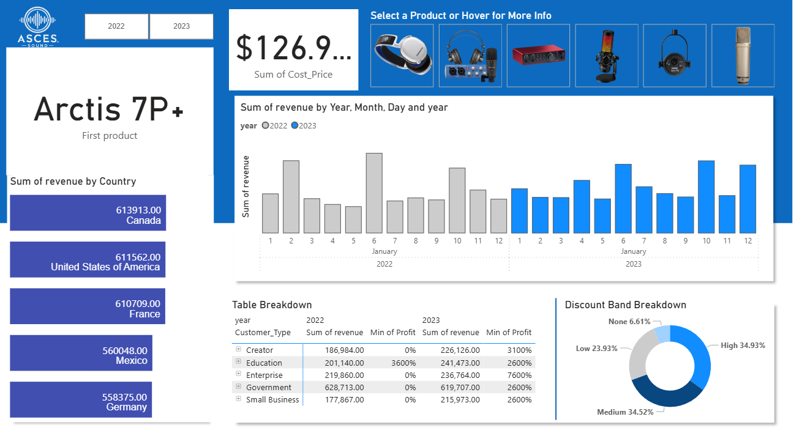
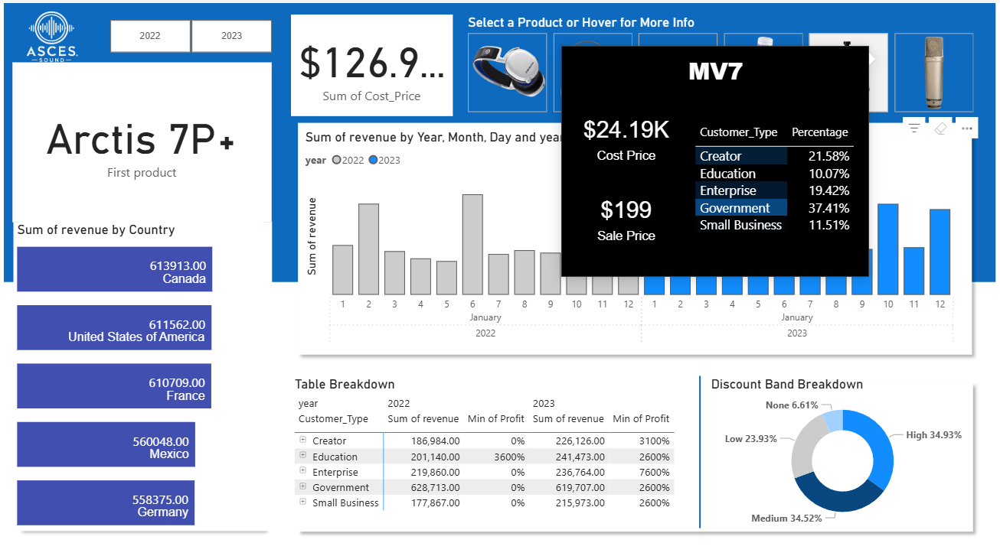

# Product Sales Dashboard 📈

This repository contains a comprehensive sales dashboard that analyzes product sales using SQL Server Management Studio (SSMS) and Power BI. The dashboard provides valuable insights into cost prices, revenue trends, and discounts across various dimensions.

## Features ⭐

- **Data Analysis**: Utilizes SSMS for querying and managing sales data.
- **Interactive Visualizations**: Built with Power BI for dynamic and insightful visual representations.
- **Tooltips**: Each product includes tooltips that provide additional information, enhancing the user experience.
- **Revenue Analysis**:
  - Sum of cost price for all products.
  - Sum of revenue segmented by country.
  - Sum of revenue broken down by year, month, and day.
- **Table Breakdown**: Detailed tabular view of sales data.
- **Discount Band Breakdown**: Analysis of sales data based on discount bands.

## Software Used ⚙️

- SQL Server Management Studio (SSMS)
- Microsoft Power BI

## SQL Queries 🛢️
[View SQL Query PDF](SQL%20Query/Query.pdf)

## Dashboard Overview 📊

  
  

